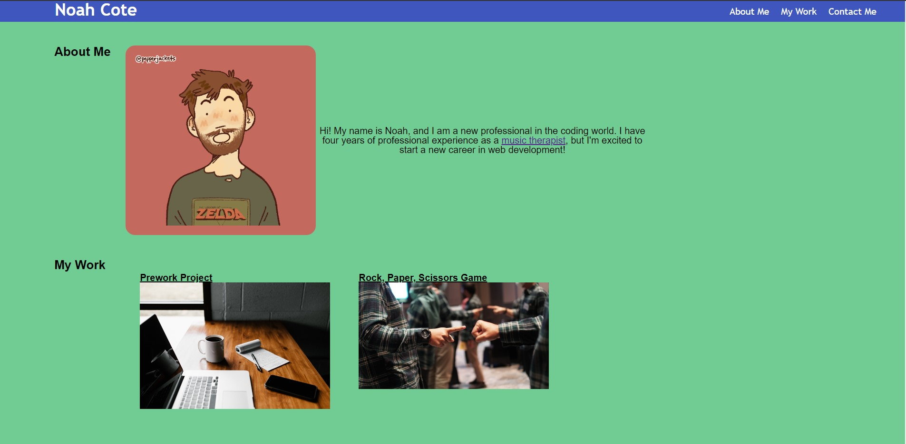

# Noah's Web Development Portfolio
## Description
This is a portfolio I developed to store projects I am working on in a fashion that is presentable to prospective employers. I used techniques such as a reset css sheet, flexboxes, and media queries to design this page. I plan to make changes to this site as I continue learning new coding techniqus.
## Portfolio Preview
Below is what the page should look like:

## Access
This project can be found [here](https://noahcote10.github.io/noahs-portfolio-site/).